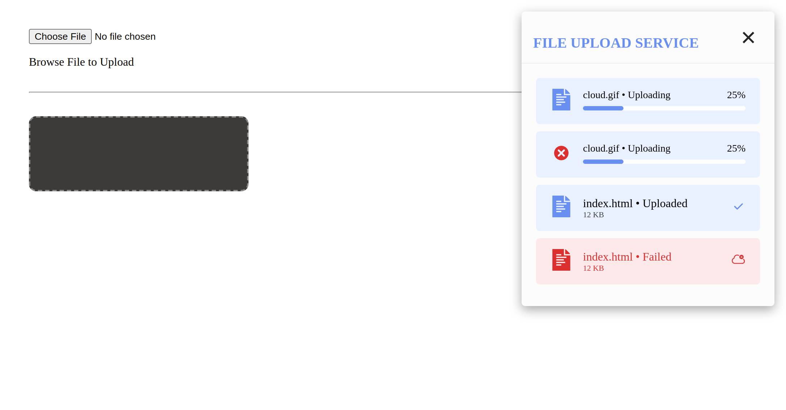

# Quick File Upload

## Preview




## How you can use in you project?

- Download or clone this repository
- include **style.css** and **script.js** on you project
- go to script file and class the class
- set your form and input element
- Example:

**index.html**

```html
<form action="#" class="quick_file_up__form">
  <input class="quick_file_up__input" type="file" name="file" />
  <p class="quick_file_up__text">Browse File to Upload</p>
</form>

<hr />

<form action="#" class="another">
  <div
    class="hidden_area"
    style="
      background-color: #3d3a3a;
      max-width: 300px;
      height: 100px;
      cursor: pointer;
      border-radius: 10px;
      border: 2px dashed #8a8787;
    "
  >
    <input type="file" name="file" class="another_input" hidden />
  </div>
</form>
```

**script.js**

```js
// Go to the last line of script and you can see this
// Call main function
window.onload = function () {
  // Example 1
  new QuickFileUp({
    form: ".quick_file_up__form",
    input: ".quick_file_up__input",
  });

  // Example 2
  const config = {
    form: ".another",
    input: ".another_input",
    isInputHidden: true,
    parentForInputHidden: ".hidden_area",
  };
  new QuickFileUp(config);
};
```
